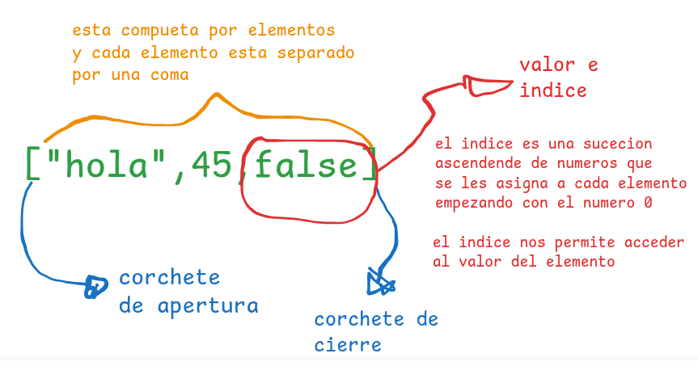
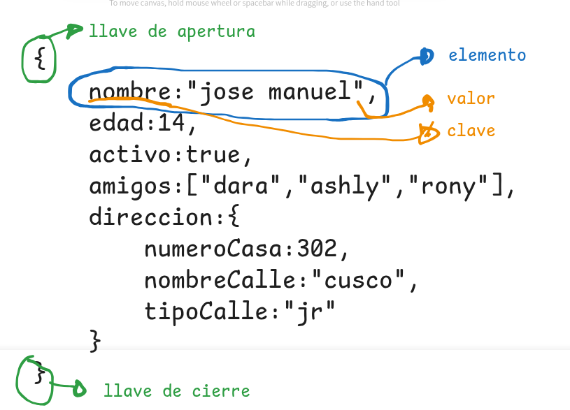

 # Taller de repaso de JavasCript
> [WARNINGS] Observasion: Quokka se debe ejecutar en cada archivo 
> [!Tip] Quokka detecta que en nuestro proyecto tenemos nodesjs y lo ejecuta para poder ver la consola en vivo 
 ## 1. Tipos de datos
 > Es la manera como capturamos la informacion 
 > En Javascript se clasifican en dos grandes grupos:
 > [!tip]
  Javascrip tinene funciones predeterminados por ejemplo para mostrar un mensaje por consola **console.log()**, para poder verificar que tipo de dato estamos mostrando en Javascript tambien tenemos una funcion llamada typeof **typeof()**  
 ### Primitivos 
 Son datos que siempre existiran 
 1. **Numericos** 
    - enteros positivos 
    - enteros negativos 
    - decimal positivo 
    - decimal negativo 
    - Nan (not a number)
 2. **Texto**
    - caracteres 
    - caracteres especiales 
    - string
 3. **Booleanos**
    - Solo pueden ser `true` o `false`
 4. 
 ### Estructurados 
 1. Array (lista)
   - array de tipo numerico
   - array de tipo string
   - array de tipo mixto
 - como esta estructura un array en javascript 
   
 1. objetos (diccionario)  
   - son similares alas listas con la unica diferencia que en vez de tener valor e indice sus elemntos trabajan con clave y valor.
 - como esta estructuradio un objeto en javascript
      
 ## 2. Variables (Enlaces, Binding)
 Las **variables** en JavaScript se utilizan para almacenar datos que pueden cambiar durante la ejecución del programa. El término "enlace" o "binding" se refiere a la asociación de un nombre con un valor.
 [!Note]
 tenemos dos pasos para crear una variable/constante
 1. primero declarar la variable/constante
 2. segundo inicializar la variable/constante
 **Obcervacion** para crear una variable primero tenemos que crear el enlace luego darle el nombre de la variable/contante: para las variables tenemos las palabras recervadas `keyword`, `let`, `var`.
 para las constantes tenemos las palabras recervada
 `keyword` - `const`
**Recomendaciones** 
- Usa `let` para variables cuyo valor puede cambiar.
- Usa `const` para valores constantes.
- Evita `var` en código moderno.
 `let`,`var` ambos 
 ## 3. Operadores
 su clasificasion general se divide en tres 
 1. **operadores unarios**
    los operadores unarios son aquellos que tiene el operador a la izquierda del valor y que retornan un nuevo valor 
    - operador de negacion 
 2. **operadores binarios** 
    los operadores binarios son aquellos que estan medio de dos valores que retornan un unico valor 
    - operadores aritmeticos
    - operadores comparacion 
    - operadores logicos 
 3. **operadores ternario**
    los operadores ternario son aquellos que evaluan tre valores y que retornan un solo valor 
    - operador condicional 
 ## 4. Contoroles de flujo 
 ## 5. Funciones 
 ## 6. Metodos para trabajar con datos estructurados 
 Son acciones o funciones que nos permiten:

 ### acceder
  Permite obtener un valor de un array u objeto.
  ```javascript
  let numeros = [10, 20, 30];
  let persona = { nombre: "Ana", edad: 25 };

  console.log(numeros[1]);      // 20
  console.log(persona.nombre);  // "Ana"
  ```

 ### modificar
  Permite cambiar el valor de un elemento existente.
  ```javascript
  numeros[0] = 100;         // [100, 20, 30]
  persona.edad = 26;        // { nombre: "Ana", edad: 26 }
  ```

 ### insertar
  Agrega nuevos elementos o propiedades.
  ```javascript
  numeros.push(40);         // [100, 20, 30, 40]
  persona.ciudad = "Lima";  // { nombre: "Ana", edad: 26, ciudad: "Lima" }
  ```

 ### eliminar
  Quita elementos o propiedades.
  ```javascript
  numeros.pop();            // [100, 20, 30]
  delete persona.edad;      // { nombre: "Ana", ciudad: "Lima" }
  ```

 | 1e2n y 3### ordenar
  Organiza los elementos de un array.
  ```javascript
  numeros.sort();           // [20, 30, 100]
  ```
  ## 7. Dom